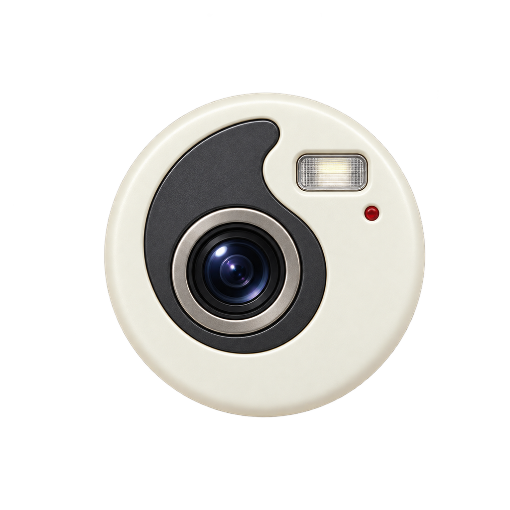
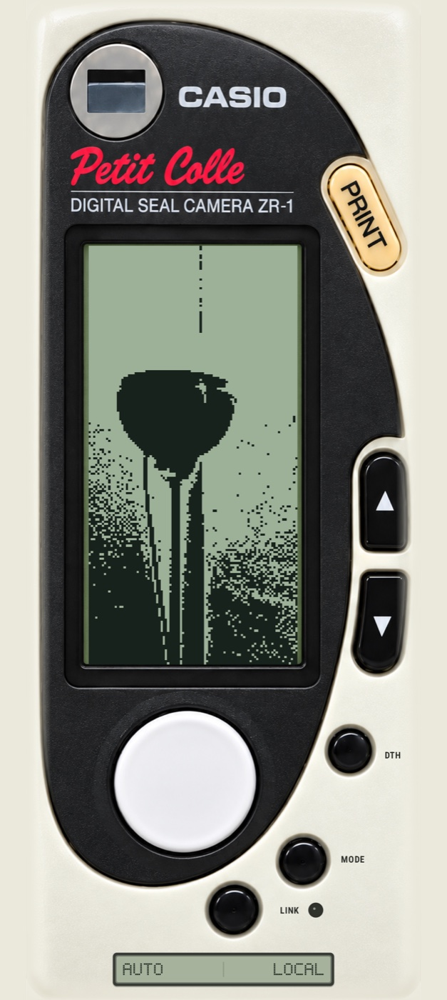
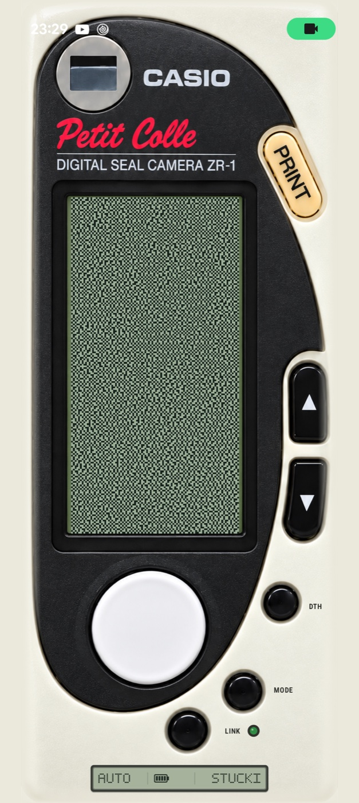

# Petit Colle Camera

<p align="center">
  
</p>

<p align="center"><strong>A tiny 1-bit instant sticker camera for Android.</strong></p>

Petit Colle Camera is an experimental Android camera that turns a phone and a Fichero Bluetooth label printer into a tiny 1-bit instant sticker camera. Its interface and immediate capture workflow are inspired by the Casio Petit Colle ZR-1.

The live viewfinder is the actual **96 × 192 binary image** sent to the printer. Exposure, contrast, threshold, zoom, error diffusion, and rendering style can all be judged before taking the picture. Captured photos are also saved as a separate higher-resolution interpretation for viewing in the phone gallery.

## Screenshots

<table>
  <tr>
    <td align="center"></td>
    <td align="center"></td>
  </tr>
  <tr>
    <td align="center"><strong>LOCAL</strong><br>Adaptive local threshold preview</td>
    <td align="center"><strong>STUCKI</strong><br>Error-diffusion preview with printer battery status</td>
  </tr>
</table>

> [!IMPORTANT]
> This is an unofficial, independent project. It is not affiliated with or endorsed by Casio, Fichero, Action, AiYin, or Xiamen Print Future Technology. Product and company names belong to their respective owners.

## Project status

The app is a working personal-source release. It has been tested with:

- a Google Pixel running a current Android release;
- a printer advertising as `FICHERO_5836_BLE`;
- the AiYin D11s-compatible BLE services described below;
- 96 × 192 thermal preview and printing;
- camera switching, freezing, gallery saving, automatic tone calibration, and manual refinement.

Other Fichero-branded printers may use different hardware and protocols. They are not guaranteed to work.

## Features

- Full-screen camera interface modeled after late-1990s Casio hardware.
- Live 96 × 192 monochrome preview that matches the print raster exactly.
- Per-style AUTO calibration with manual refinement from the latest automatic values.
- Rear and front camera support.
- One-button capture and gallery saving.
- Direct BLE printing to a compatible Fichero/AiYin D11s printer.
- Separate higher-resolution gallery rendering that preserves the selected 1-bit style.
- No account, analytics, advertising SDK, cloud service, or internet permission.

## Controls

| Control | Short press | Press and hold |
| --- | --- | --- |
| Large white button | Freeze and save the current picture. Press again to return to live view. | — |
| Yellow `PRINT` button | From live view: capture, save, and print. From a frozen picture: print that picture. | — |
| `DTH` | Move to the next rendering style. Each newly selected style starts in AUTO. | Return the current style to AUTO. |
| `MODE` | In AUTO, adopt the latest automatic values and enter MANUAL. In MANUAL, move through Light, Contrast, Cut, Error, and Zoom. | Restore all settings for the current rendering style. |
| Up/down arrows | Increase or decrease the selected manual value. | Reset the selected value to its default. |
| `LINK` | Scan for and connect to the printer. | — |
| Main viewfinder | Switch between the rear and front cameras. | — |
| `CASIO` mark | Open the built-in guide. | — |

The lower LCD shows `AUTO` or `MANUAL` on the left, live printer battery and warning pictograms in the center, and the active rendering style on the right. Cover-open, paper-out, low-battery, charging, and overheat states are read from the printer. The LED beside LINK is dark when disconnected, amber while connecting, green when ready or printing, and red after a printer or connection error.

## Rendering styles

DTH cycles through the following styles in this order:

1. **MAC** — Atkinson error diffusion; the default photographic mode.
2. **FLOYD** — Floyd–Steinberg error diffusion.
3. **STUCKI** — Stucki error diffusion.
4. **BLUE** — blue-noise ordered dithering.
5. **DOT** — Bayer ordered dithering.
6. **CLUSTER** — clustered-dot ordered dithering.
7. **LOCAL** — adaptive local thresholding.
8. **HALF** — coarse halftone dots.
9. **CUT** — direct threshold rendering.
10. **EDGE** — graphic edge illustration with restrained shadow fill.
11. **ASCII** — compact bitmap-character rendering.
12. **STIPPLE** — clustered stipple rendering.
13. **CONTOUR** — iso-luminance contours with edge emphasis.

Each style stores its own manual settings. Cycling to a style starts a new AUTO calibration; pressing MODE adopts the current automatic result so it can be refined manually.

## Image pipeline

The print path is deliberately small and direct:

```text
Camera Y plane
→ centered vertical 1:2 crop
→ area sampling at 96 × 192
→ automatic tone curve or manual global correction
→ restrained Laplacian sharpening
→ selected 1-bit renderer
→ identical preview and printer raster
```

The gallery path starts from the same crop and tonal interpretation but renders a larger artistic version:

- conventional pixel dithers use a 384 × 768 logical bitmap, enlarged 3× with nearest-neighbour sampling;
- procedural styles are rerendered at 1152 × 2304 while preserving their intended relative pattern scale.

The gallery image is therefore a higher-resolution interpretation of the same shot, while the live display remains an exact preview of the physical print.

## Supported printer protocol

The BLE implementation targets the **Fichero D11s / AiYin D11s** family. The printer has a 96-pixel-wide, 203-DPI thermal head and accepts packed 1-bit raster rows.

The protocol origin is the reverse-engineering work published by **0xMH**:

- [0xMH/fichero-printer](https://github.com/0xMH/fichero-printer)
- [Fichero D11s protocol reference](https://github.com/0xMH/fichero-printer/blob/main/docs/PROTOCOL.md)
- [Reverse Engineering Action's Cheap Fichero Labelprinter](https://blog.dbuglife.com/reverse-engineering-fichero-label-printer/)

That research identifies the Fichero unit as an AiYin D11s made by Xiamen Print Future Technology and documents the BLE characteristics, raster format, and AiYin-specific enable/stop commands. The upstream README identifies `fichero-printer` as MIT-licensed.

This Android project contains its own Kotlin implementation of those documented protocol findings. It currently supports these BLE service layouts:

| Service | Write characteristic | Notify characteristic |
| --- | --- | --- |
| `000018f0-0000-1000-8000-00805f9b34fb` | `00002af1-0000-1000-8000-00805f9b34fb` | `00002af0-0000-1000-8000-00805f9b34fb` |
| `0000ff00-0000-1000-8000-00805f9b34fb` | `0000ff02-0000-1000-8000-00805f9b34fb` | `0000ff01-0000-1000-8000-00805f9b34fb` |

The scanner recognizes advertised names containing `FICHERO`, `D11S`, or `AIYIN`. Printing uses the documented AiYin setup commands, an ESC/POS-style `GS v 0` raster header, 12 bytes per 96-pixel row, a form feed, and the AiYin stop command.

## Permissions and privacy

| Permission | Purpose |
| --- | --- |
| Camera | Provides the live viewfinder and captured source image. |
| Bluetooth scan/connect | Finds and communicates with the printer on Android 12 and newer. Requested only when LINK is used. |
| Legacy external storage write | Saves pictures on Android 8 and 9. It is not requested on newer Android versions. |

Photos are processed locally. The app does not request internet access and does not send images, printer identifiers, or usage data anywhere.

## Requirements

- Android 8.0 / API 26 or newer.
- A camera.
- Bluetooth Low Energy for printing.
- A compatible Fichero/AiYin D11s printer for physical output.
- Android Studio with JDK 17 and Android SDK 36 for development.

The printer does not need to be paired in Android's Bluetooth settings. Turn it on and use LINK inside the app.

## Build from source

The repository includes the Gradle wrapper. On macOS or Linux:

```bash
./gradlew assembleDebug
```

On Windows:

```powershell
.\gradlew.bat assembleDebug
```

The resulting debug APK is written to:

```text
app/build/outputs/apk/debug/app-debug.apk
```

Install it with Android Debug Bridge:

```bash
adb install -r app/build/outputs/apk/debug/app-debug.apk
```

You can also open the repository in Android Studio, allow Gradle to synchronize, select an Android device, and run the `app` configuration.

Release artifacts can be compiled with:

```bash
./gradlew assembleRelease bundleRelease
```

Release APKs and app bundles are unsigned until you configure your own signing key. Do not commit keystores, passwords, or `keystore.properties`.

## Source layout

```text
app/src/main/java/com/petitcolle/camera/
├── CameraActivity.kt     Camera lifecycle, controls, saving, and custom interface
├── FicheroPrinter.kt     BLE discovery, connection, packet generation, and printing
└── ThermalRenderer.kt    crop, tone calibration, sharpening, and 1-bit renderers

app/src/main/res/
├── drawable-nodpi/       faceplate and launcher artwork
├── drawable/             monochrome launcher artwork
├── mipmap-anydpi/        adaptive launcher icon
└── values/               theme and color resources
```

## Known limitations

- Only the two BLE service layouts listed above are implemented.
- Print width and height are fixed at 96 × 192.
- The interface is intentionally portrait-only.
- Hardware testing has focused on one Fichero/AiYin D11s unit and one Android phone.

## Contributing

Bug reports and focused pull requests are welcome. When changing rendering code, judge the result at the real 96 × 192 binary resolution and keep the live preview identical to the printer raster. When changing the BLE transport, include the printer model, advertised Bluetooth name, and firmware version used for testing.

## License

Petit Colle Camera is available under the [MIT License](LICENSE). You may use, copy, modify, and distribute the project under its terms.

The separately referenced [`0xMH/fichero-printer`](https://github.com/0xMH/fichero-printer) project is also published under the MIT License and retains its own copyright and license notices.
